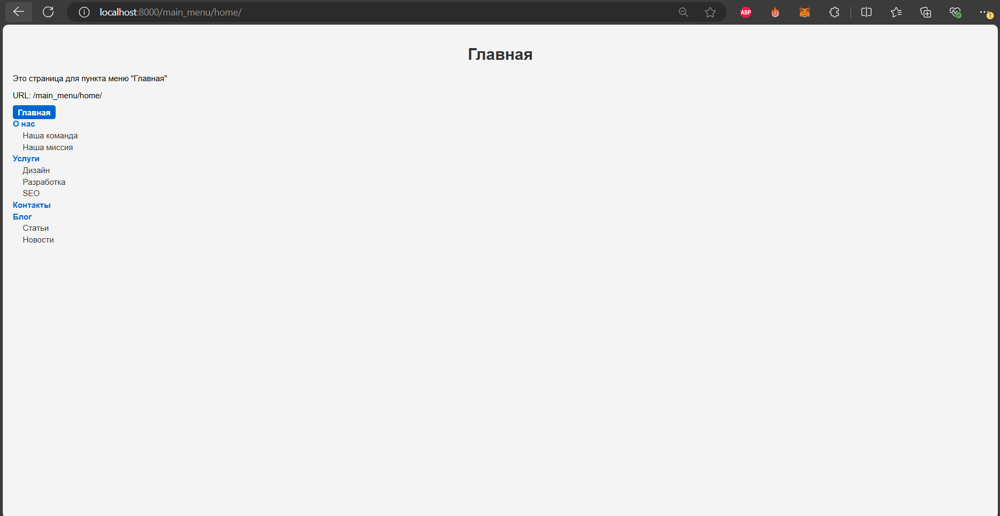

# Разработан сервис по созданию древовидного меню  
## Внешний вид:  
  
Для запуска приложения вам надо:  
`pip install -r requirements.txt` - для установки зависимостей  
`python manage.py migrate` - для проведения миграций  
`python manage.py fill_db` - кастомный скрипт для заполнения БД  
После приложние будет запущено на localhost. Порт: 8000.  
Перейдите на url /main_menu/home/ и окажетесь на главной странице.

**P.S.**
 Старался сделать как можно проще и со вкусом без лишних деталей,  
надеюсь не упустил пунктов из ТЗ. Желаю хорошего дня.  
